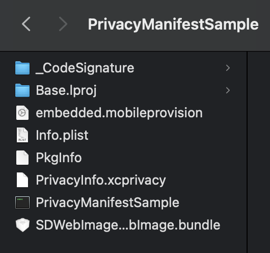
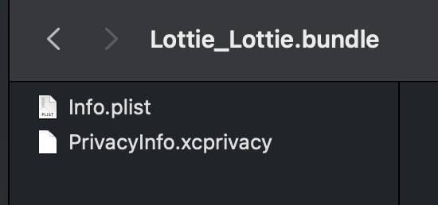

# PrivacyManifestSample

This sample app contains two privacy manifests: one from `SDWebImage` SPM dependency and one from the app itself.
Dependency will be statically linked and, when archived, the app container will look like this:

With dependency's manifest inside the bundle:

When uploaded to Testflight, app's manifest (contaning `NSPrivacyAccessedAPICategoryUserDefaults`) will be processed correctly, while dependency's manifest will be ignored and we will get this:

> ITMS-91053: Missing API declaration - Your app’s code in the “PrivacyManifestSample” file references one or more APIs that require reasons, including the following API categories: NSPrivacyAccessedAPICategoryFileTimestamp. While no action is required at this time, starting May 1, 2024, when you upload a new app or app update, you must include a NSPrivacyAccessedAPITypes array in your app’s privacy manifest to provide approved reasons for these APIs used by your app’s code. For more details about this policy, including a list of required reason APIs and approved reasons for usage, visit: https://developer.apple.com/documentation/bundleresources/privacy_manifest_files/describing_use_of_required_reason_api.